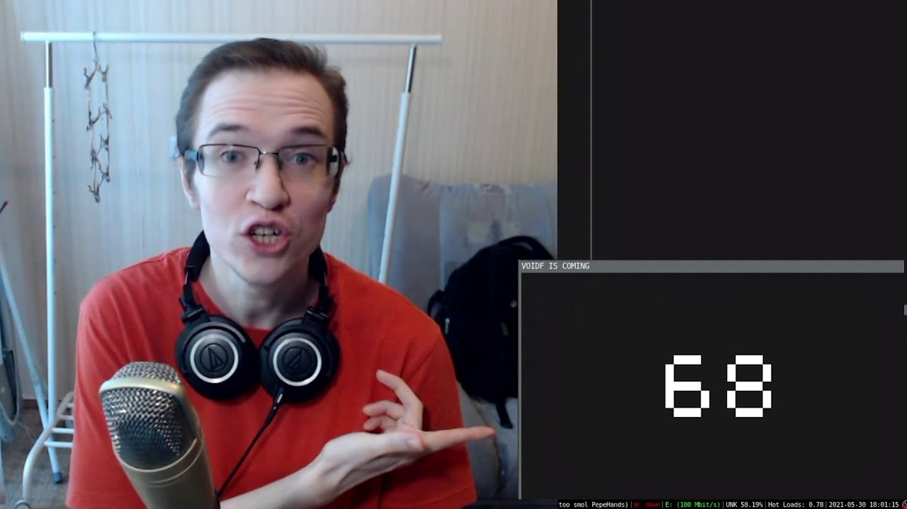

# C-MEANS

## Overview

C-MEANS is a data mining project aimed at implementing the k-means algorithm in pure C for clustering data and visualizing the results using the raylib library. The project leverages graph visualization to iteratively display the clustering process, providing insights into the data distribution and cluster formation.

## Features

- Implementation of the k-means algorithm in pure C.
- Utilization of the raylib library for rendering and visualization.
- Graphical representation of the data points and centroids.
- Iterative visualization of the clustering process.
- Flexible and customizable parameters for clustering.

## References

- [K-MEANS](https://en.wikipedia.org/wiki/K-means_clustering)
- [raylib library](https://www.raylib.com/)
- [Data mining in C by tsoding](https://www.youtube.com/watch?v=kH-hqG34ylA&t=692s&pp=ygUNZGF0YSBtYW5pbmcgYw%3D%3D)

  ## For my love <3 

